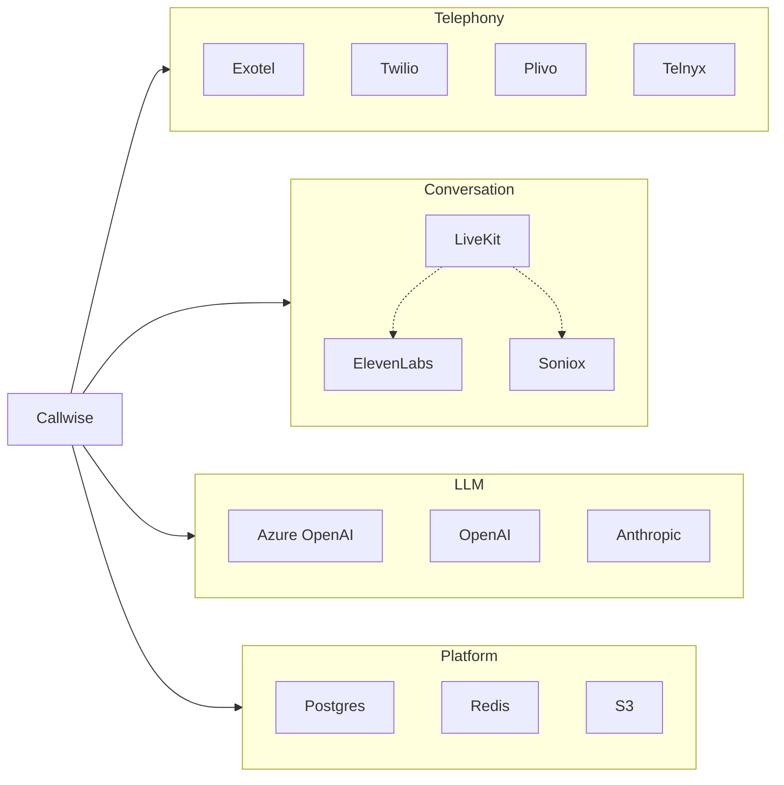

# Vendors & external documentation

Callwise integrates many external products across telephony, conversation AI, LLMs,
infrastructure, and observability. Use this page to find the right official docs (or
Cursor MCP servers) when implementing adapters, webhooks, or ops runbooks.

**PRD reference:** §1.1 (provider matrix), §13 (observability), §14.5 (secrets), §15
(infrastructure).

**Implementation status legend**

| Status | Meaning |
|--------|---------|
| **Live** | Code + routes exist and are used in dev/prod paths |
| **Stub** | Module exists; adapter body not finished |
| **Planned** | Named in PRD/config only; factory not wired |
| **Ops** | Runtime dependency, not a product API |

---

## Telephony (PSTN)

| Vendor | Role | Status | Config / code | Documentation |
|--------|------|--------|---------------|---------------|
| **Exotel** | India PSTN, call-status webhooks, signed call-context for ConvAI | **Live** | `TELEPHONY_PROVIDER=exotel`, `providers/telephony/exotel.py`, `webhook_ingest/routers/exotel.py`, `context.py` | https://developer.exotel.com/ |
| **Twilio** | PSTN, status callbacks | **Live** (HMAC verify TODO in non-dev) | `TELEPHONY_PROVIDER=twilio`, `providers/telephony/twilio.py`, `webhook_ingest/routers/twilio.py` | https://www.twilio.com/docs |
| **Plivo** | PSTN (pluggable) | **Planned** | `TelephonyProvider.plivo` in `config.py` only | https://www.plivo.com/docs/ |
| **Telnyx** | PSTN (pluggable) | **Planned** | `TelephonyProvider.telnyx` in `config.py` only | https://developers.telnyx.com/ |
| **Mock** | Local/dev simulated dial | **Live** | `TELEPHONY_PROVIDER=mock` (compose default) | — |

Optional Python extra: `twilio` (`pyproject.toml` → `[project.optional-dependencies].telephony`).

---

## Conversation / voice AI

| Vendor | Role | Status | Config / code | Documentation |
|--------|------|--------|---------------|---------------|
| **ElevenLabs** | ConvAI (SIP), post-call webhooks (transcription / audio / failure) | **Live** | `CONVERSATION_PROVIDER=elevenlabs`, `providers/conversation/elevenlabs.py`, `webhook_ingest/routers/elevenlabs.py` | https://elevenlabs.io/docs |
| **LiveKit** | Real-time agent rooms (full-control path) | **Stub** | `CONVERSATION_PROVIDER=livekit`, `providers/conversation/livekit.py` | https://docs.livekit.io/ |
| **Soniox** | STT on the LiveKit path (PRD §5.4) | **Planned** | Referenced in `livekit.py` / `conversation/base.py` comments only | https://soniox.com/docs |
| **Mock** | Simulated conversation | **Live** | `CONVERSATION_PROVIDER=mock` (compose default) | — |

Optional Python extra: `elevenlabs` (`pyproject.toml` → `conversation`).

**LiveKit stack (when built):** Soniox STT → LLM → ElevenLabs TTS inside a ScriptEngine FSM;
mutable `ConversationState` checkpointed to Redis (`domain/state.py`).

---

## LLM (verification, summarization)

| Vendor | Role | Status | Config / code | Documentation |
|--------|------|--------|---------------|---------------|
| **Azure OpenAI** | Default production LLM | **Stub** | `LLM_PROVIDER=azure_openai`, `providers/llm/azure_openai.py` | https://learn.microsoft.com/azure/ai-services/openai/ |
| **OpenAI** | Alternative LLM | **Stub** | `LLM_PROVIDER=openai`, `providers/llm/openai.py` | https://platform.openai.com/docs |
| **Anthropic** | Alternative LLM | **Stub** | `LLM_PROVIDER=anthropic`, `providers/llm/anthropic.py` | https://docs.anthropic.com/ |
| **Mock** | Deterministic verification in dev | **Live** | `LLM_PROVIDER=mock` (compose default) | — |

Optional Python extras: `openai`, `anthropic` (`pyproject.toml` → `llm`).

Post-call pipeline: `domain/verification.py`, `workers/verification.py`.

---

## Data platform & object storage

| Vendor | Role | Status | Config / code | Documentation |
|--------|------|--------|---------------|---------------|
| **PostgreSQL** | System of record | **Ops** | `DATABASE_URL`, `DATABASE_URL_DIRECT`, `db/`, Alembic | https://www.postgresql.org/docs/ |
| **PgBouncer** | Transaction pooling (required at scale) | **Ops** | `docker-compose.yml`, `infra/pgbouncer/`, PRD §15.3 | https://www.pgbouncer.org/ |
| **Redis** | Streams queue, locks, governors, conversation state | **Ops** | `REDIS_URL`, `queue/`, `locks.py`, `governors/`, `redis_pool.py` | https://redis.io/docs/ |
| **AWS S3** | Recordings, transcripts, upload artifacts | **Planned** (presign TODO) | `aioboto3`, `S3_*` env vars, `control_api/routers/recordings.py` | https://docs.aws.amazon.com/s3/ |
| **MinIO** | S3-compatible store for local dev | **Ops** | `docker-compose.yml` service `minio` | https://min.io/docs/ |

Production targets (PRD §15): **RDS** (Postgres), **ElastiCache** (Redis), **S3** (+ Glacier lifecycle).

---

## AWS (production secrets & scale path)

| Service | Role | Status | Documentation |
|---------|------|--------|---------------|
| **Secrets Manager** | API keys, webhook secrets, JWT material | **Ops** (PRD §14.5) | https://docs.aws.amazon.com/secretsmanager/ |
| **Systems Manager (SSM) Parameter Store** | Alternative secret/config injection | **Ops** | https://docs.aws.amazon.com/systems-manager/latest/userguide/systems-manager-parameter-store.html |
| **ElastiCache** | Managed Redis (cluster mode, AOF) | **Ops** | https://docs.aws.amazon.com/elasticache/ |
| **RDS** | Managed Postgres (primary + read replica) | **Ops** | https://docs.aws.amazon.com/rds/ |
| **SQS** | Optional queue broker at very large scale | **Planned** | https://docs.aws.amazon.com/sqs/ |

Injected via env at runtime; never committed (see `.env.example`, `infra/k8s/config.example.yaml`).

---

## Kubernetes & autoscaling

| Vendor | Role | Status | Code / infra | Documentation |
|--------|------|--------|--------------|---------------|
| **Kubernetes** | Deployment platform | **Ops** | `infra/k8s/` | https://kubernetes.io/docs/ |
| **KEDA** | Scale dialer/verification workers on Redis Stream lag | **Ops** | `infra/k8s/dialer-worker.yaml`, `verification-worker.yaml` | https://keda.sh/docs/ |
| **External Secrets Operator** | Sync AWS secrets into cluster | **Ops** (example only) | `infra/k8s/config.example.yaml` | https://external-secrets.io/ |

---

## Observability & CI

| Vendor | Role | Status | Code | Documentation |
|--------|------|--------|------|---------------|
| **Prometheus** | Metrics exposition | **Live** | `prometheus-client`, `/metrics` on both APIs, `observability/metrics.py` | https://prometheus.io/docs/ |
| **Grafana** | Dashboards (PRD §13.2) | **Planned** | — | https://grafana.com/docs/ |
| **OpenTelemetry** | Distributed tracing | **Partial** | `opentelemetry-*` deps, `observability/tracing.py` | https://opentelemetry.io/docs/ |
| **Loki** | Log aggregation (PRD §13.1) | **Planned** | Structured JSON logs via `logging.py` | https://grafana.com/docs/loki/latest/ |
| **ELK** | Alternative log stack (PRD) | **Planned** | — | https://www.elastic.co/guide/ |
| **GitHub Actions** | CI: lint, typecheck, test, image build | **Live** | `.github/workflows/ci.yml` | https://docs.github.com/actions |
| **Trivy** | Container image vulnerability scan | **Live** | CI workflow | https://aquasecurity.github.io/trivy/ |

---

## Application stack (libraries — not vendor APIs)

These are dependencies, not integrations to wire MCP/docs for unless debugging the framework
itself.

| Package | Purpose |
|---------|---------|
| **FastAPI / Uvicorn / Starlette** | Control API + webhook ingest |
| **SQLAlchemy / Alembic / asyncpg** | ORM + migrations |
| **Pydantic / pydantic-settings** | Config + schemas |
| **httpx** | Outbound HTTP to providers |
| **PyJWT** | JWT auth + short-lived context tokens |
| **argon2-cffi** | Password hashing |
| **phonenumbers** (libphonenumber) | E.164 normalization (`domain/phone.py`) |
| **structlog** | Structured logging |
| **tenacity** | Retry helpers (where used) |
| **openpyxl** | Contact list uploads |
| **Next.js / React / Tailwind** | Dashboard (`frontend/`) |

---

## Compliance frameworks (not vendors)

Referenced in PRD §14.2 for governors and product behavior — use regulatory guidance, not
product API docs.

| Framework | Region | Topic |
|-----------|--------|--------|
| **TRAI** | India | Calling windows, DND |
| **TCPA** | United States | Outbound telemarketing rules |

---

## Environment variables (provider selection)

From `.env.example` / `config.py`:

```bash
TELEPHONY_PROVIDER=mock      # mock | exotel | twilio | plivo | telnyx
CONVERSATION_PROVIDER=mock   # mock | elevenlabs | livekit
LLM_PROVIDER=mock            # mock | azure_openai | openai | anthropic
```

Provider-specific secrets (non-exhaustive): `EXOTEL_*`, `TWILIO_*`, `ELEVENLABS_*`,
`LIVEKIT_*`, `AZURE_OPENAI_*`, `OPENAI_API_KEY`, `ANTHROPIC_API_KEY`, `ELEVENLABS_WEBHOOK_SECRET`.

Rate-limit defaults per provider: `RATE_LIMIT_EXOTEL`, `RATE_LIMIT_TWILIO`, `RATE_LIMIT_ELEVENLABS`
(parsed in `Settings.provider_rate_limits`).

---

## Suggested Cursor MCP / doc index priority

When adding documentation MCP servers, prioritize vendors that are **Live** or **next on
the rollout** (PRD §17):

1. **Exotel** — telephony + webhooks + India context bridge  
2. **ElevenLabs** — ConvAI + signed webhooks  
3. **Twilio** — telephony + request signature validation  
4. **Azure OpenAI** (or OpenAI) — verification JSON schema  
5. **Redis** — Streams consumer groups, Lua governors  
6. **AWS S3** — recordings and presigned URLs  
7. **LiveKit** + **Soniox** — when implementing the full-control path  

Lower priority until wired: Plivo, Telnyx, Anthropic-only path, KEDA, PgBouncer tuning.

**Note:** A workspace MCP such as `user-docs.sarvam.ai` is not used by this repository unless
you add Sarvam as a future STT/TTS/LLM provider.

---

## Architecture map



---

## Related internal docs

- [`architecture.md`](architecture.md) — system diagram and rollout phases  
- [`idempotency.md`](idempotency.md) — webhook dedup and exactly-once design  
- [`data-model.md`](data-model.md) — Postgres tables and retention  
- [`runbooks/README.md`](runbooks/README.md) — Redis/Postgres/provider outage procedures  
- [`../PRD_Callwise_Production.md`](../PRD_Callwise_Production.md) — full engineering spec  
